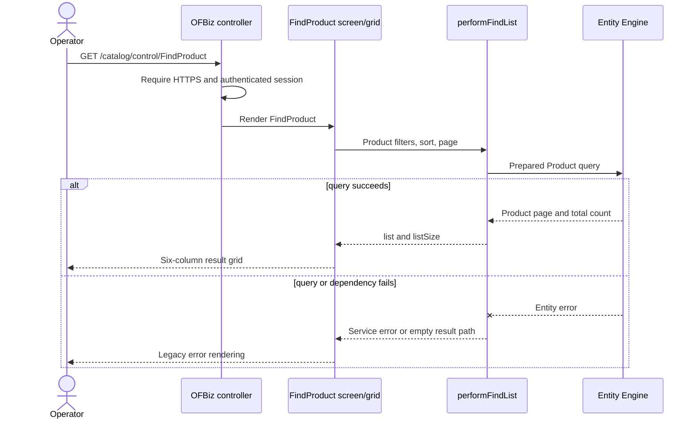

# Product catalog pilot characterization

## Decision

The read-only product/catalog journey is the approved Phase 1 pilot. Legacy OFBiz remains authoritative. Approval selects the slice for characterization; it does not authorize a route cutover or make a modern store authoritative.

Decision date: 2026-09-23

## In-scope journey

An authenticated catalog operator opens `/catalog/control/FindProduct`, optionally filters by product ID or internal name, sorts or pages the results, and follows a product ID to the legacy edit page.

The pilot covers the search page. Product detail, creation and editing, pricing, inventory availability, promotions, reviews, content, images, configuration, and category maintenance are out of scope. Following a result to `EditProduct` remains a controlled transition to legacy and keeps the modern search page in `Mixed` state.

## Observed legacy contract

| Concern | Observed behavior |
| --- | --- |
| Browser route | `/catalog/control/FindProduct` over HTTPS |
| Authentication | Required by the controller; the catalog web application also declares `OFBTOOLS,CATALOG` base permission |
| Search inputs | `productId`, `internalName`, and hidden `noConditionFind=Y` |
| Query path | `ProductForms.xml#ListProducts` invokes `performFindList` against `Product` |
| Sorting | Client-selected `sortField`; sortable legacy columns are all result fields |
| Pagination | Zero-based `viewIndex`, bounded `viewSize`, and a total `listSize` |
| Result fields | `productId`, `productTypeId`, `internalName`, `brandName`, `productName`, `description` |
| Related lookup | `productTypeId` is rendered through `ProductType` |
| Navigation | Product ID links to the write-capable legacy `EditProduct` page |
| Authority | Legacy OFBiz and its shared Entity Engine database |

The generic `performFindList` service is declared `auth="false"`. Effective protection therefore depends on the authenticated controller and web-application permission boundary. The modern API must authenticate and authorize independently rather than reproduce the generic service declaration.

## Request and failure sequence

## Characterization coverage

`ProductCatalogSearchCharacterizationTest` runs after deterministic product test data is loaded and before existing product tests mutate it. It currently protects:

- exact product-ID filtering;
- the six legacy grid fields;
- total-count and page-size behavior;
- stable requested sorting; and
- later-page behavior;
- case-insensitive internal-name matching when requested;
- the legacy `null` result-list behavior for rejected empty filters; and
- absence of `Product` or `ProductKeyword` row changes during the exact-ID read.

Required before Phase 5 implementation traffic, as recorded by the Phase 1 exit review:

- runtime HTTP tests for anonymous, authenticated-but-forbidden, and authorized users;
- invalid, oversized, and injection-like filter inputs;
- unsupported sort fields;
- effective permission and audit behavior;
- database statement capture proving all journey operations are read-only;
- production volume, latency, selectivity, and data-quality profiles;
- dependency-failure and rollback exercises.

The completed static inventory is [product-catalog-inventory.md](product-catalog-inventory.md), the repeatable local profile is [product-catalog-data-profile.md](product-catalog-data-profile.md), and the canonical draft contract is [product-catalog-v1.yaml](../../../contracts/api/product-catalog-v1.yaml).

## Proposed modern boundary

The first projection contains only the six observed result fields plus an explicit stable identifier and projection timestamp. `ProductType` descriptions may be denormalized into the projection if their freshness and localization rules are documented. No price, stock, promotion, category, content, or supplier facts enter the pilot contract implicitly.

The modern route remains disabled until a canonical OpenAPI contract, authorization policy, reconciliation query, latency target, and emergency legacy fallback have been approved and tested. While the modern UI calls a legacy-backed adapter it must display `Mixed`; it may display `Modern` only after all in-scope reads come from the approved modern projection.

## Rollback boundary

Before modern authority, rollback routes the browser journey to `/catalog/control/FindProduct` and disables the modern feature flag. Because the pilot is read-only, rollback does not reconcile competing writes. The projection may continue consuming updates for diagnosis, but it cannot serve traffic after rollback and cannot write to OFBiz tables.
